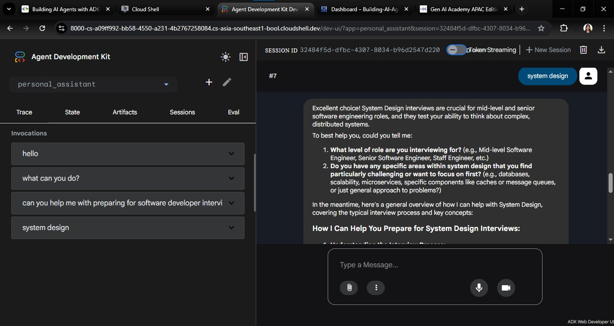
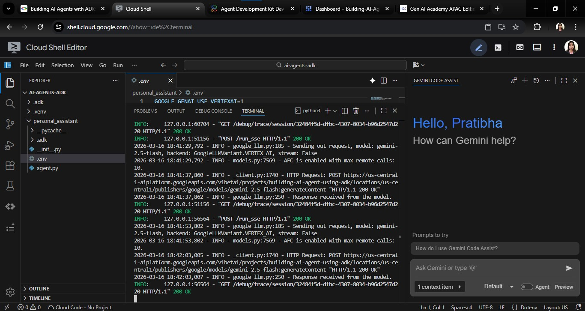

# 🚀 Deploy an ADK Agent to Cloud Run

This repository contains my implementation of the Google Codelab:

**Deploy an ADK Agent to Cloud Run**

🔗 Codelab Link  
https://codelabs.developers.google.com/codelabs/production-ready-ai-with-gc/5-deploying-agents/deploy-an-adk-agent-to-cloud-run

This lab demonstrates how to build and deploy a **production-ready AI agent** using **Google’s Agent Development Kit (ADK)** and run it on **Google Cloud Run**.

---

# 📖 Overview

In this lab, we build a **Zoo Tour Guide AI agent** that can answer questions about animals using external tools such as the **Wikipedia API**. After implementing the agent locally, the application is deployed as a **serverless container on Cloud Run**, making it accessible through a public URL. :contentReference[oaicite:0]{index=0}

The lab demonstrates how to transition from **local AI agent development to a scalable cloud deployment**.

---

# 🎯 Learning Objectives

By completing this lab you will learn how to:

- Structure a Python project for **ADK deployment**
- Implement a **tool-using AI agent**
- Deploy an AI agent to **Google Cloud Run**
- Configure **secure service accounts and IAM permissions**
- Test a deployed AI agent using the **ADK developer UI**

These steps help move AI agents from **prototype stage to production-ready services**. :contentReference[oaicite:1]{index=1}

---

# 🛠 Tech Stack

- **Python**
- **Google Agent Development Kit (ADK)**
- **Gemini / Vertex AI**
- **Google Cloud Run**
- **Docker / Containers**
- **Wikipedia API**

---

# ⚙️ Prerequisites

Before running this project, ensure you have:

- A **Google Cloud account**
- A **Google Cloud project with billing enabled**
- **Cloud Shell or local development environment**
- Installed **Google Cloud CLI**
- Python **3.12+**

---
