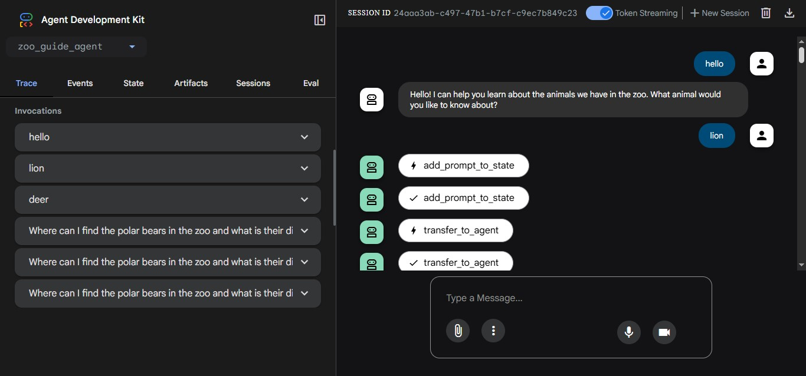
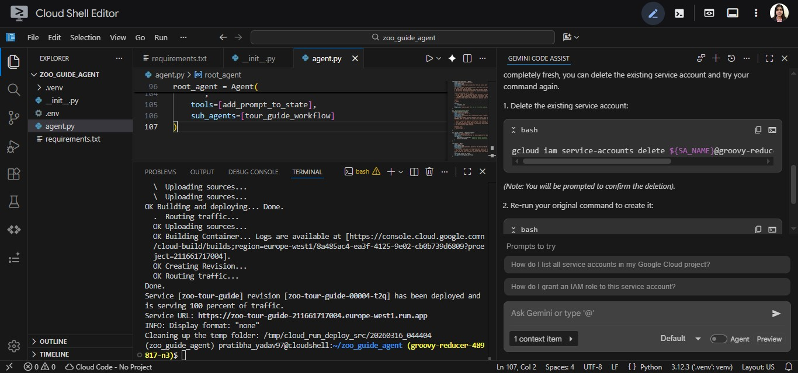

# 🚀 Building AI Agents with ADK – Foundation Lab

This repository contains my implementation of the **Google Codelab: Building AI Agents with ADK – The Foundation**.

The lab introduces the fundamentals of building AI agents using **Google’s Agent Development Kit (ADK)** powered by **Gemini models**. The goal is to create a simple **personal assistant AI agent** that can understand and respond to user queries.

📌 Codelab:  
https://codelabs.developers.google.com/devsite/codelabs/build-agents-with-adk-foundation

---

# 📖 Overview

AI agents are intelligent programs that can perceive their environment, make decisions, and perform actions to accomplish tasks. They typically use **Large Language Models (LLMs)** as their reasoning engine. :contentReference[oaicite:0]{index=0}

In this lab we build a **basic conversational AI agent** using Google ADK and run it in a development environment.

---

# 🎯 Objectives

In this lab you will learn how to:

- Set up a **Python development environment**
- Install and configure **Agent Development Kit (ADK)**
- Build a **personal assistant AI agent**
- Run and test the agent locally
- Understand the basic **architecture of AI agents**

The codelab serves as the **foundation for building more advanced multi-agent systems later.** :contentReference[oaicite:1]{index=1}

---

# 🛠 Tech Stack

- **Python 3.12**
- **Google Agent Development Kit (ADK)**
- **Gemini Models**
- **Google Cloud**
- **Cloud Shell**
