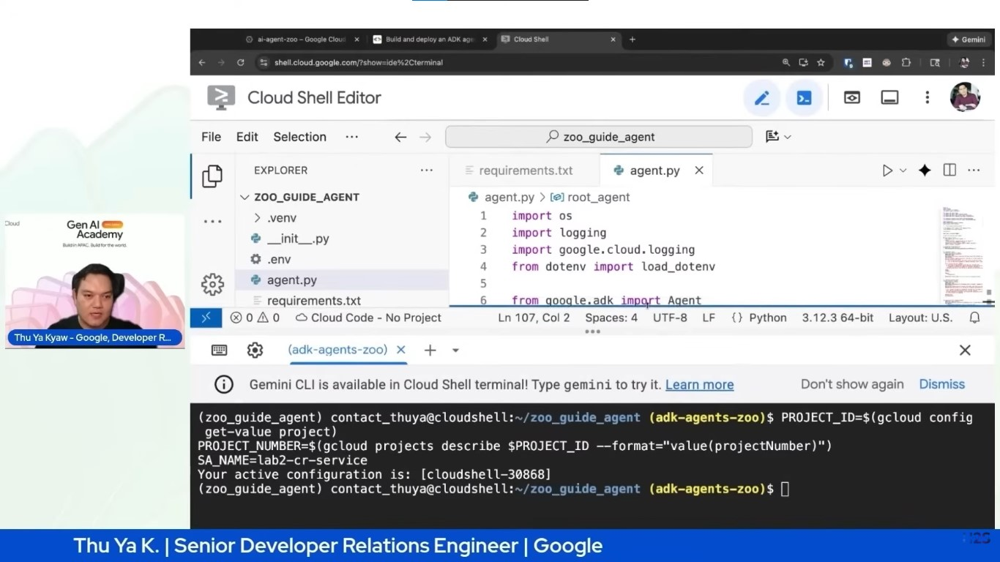

# 🚀 GenAI Academy APAC – Track 1

This repository contains my work from **GenAI Academy APAC Edition – Track 1**, where I built and deployed **AI Agents using the Agent Development Kit (ADK)** and deployed them on **Google Cloud Run**.

The labs focus on the **foundations of AI agents and scalable cloud deployment** using modern **Generative AI infrastructure**.

---

# 📚 Labs Completed

## 🧪 Lab 1 — Build and Deploy an ADK Agent on Cloud Run

In this lab, an **AI agent was built and deployed in a serverless environment**.

### Key Learnings
- Creating an AI agent using **Agent Development Kit (ADK)**
- Containerizing the agent
- Deploying applications using **Google Cloud Run**
- Running scalable AI services

### Deployment Flow

User Request → AI Agent (ADK) → LLM Processing → Response → Cloud Run Deployment

---

## 🧪 Lab 2 — Building AI Agents with ADK: The Foundation

This lab focused on **understanding the architecture and design of AI agents**.

### Key Concepts

- Agent Development Kit (ADK)
- Agent architecture
- Prompt handling
- Agent workflows
- AI response generation

---

# 🛠 Tech Stack

| Technology | Purpose |
|-----------|--------|
| Python | Agent development |
| Google Cloud Run | Serverless deployment |
| Agent Development Kit (ADK) | AI agent framework |
| Docker | Containerization |
| Generative AI | Response generation |

---

# 🎯 Key Skills Demonstrated

- AI Agent Development
- Cloud Deployment
- Generative AI Integration
- Serverless Architecture
- Python-based AI systems

---

# 🌏 Program

This project is part of **GenAI Academy APAC Edition**, which helps developers learn how to build **modern AI-powered applications using Google Cloud and Generative AI technologies**.

---

# 👩‍💻 Author

**Pratibha Yadav**

🎓 BTech – Computer Science Engineering  
💻 Interested in **AI, Machine Learning, and Software Development**

---

⭐ If you found this project helpful, consider **starring the repository**.
